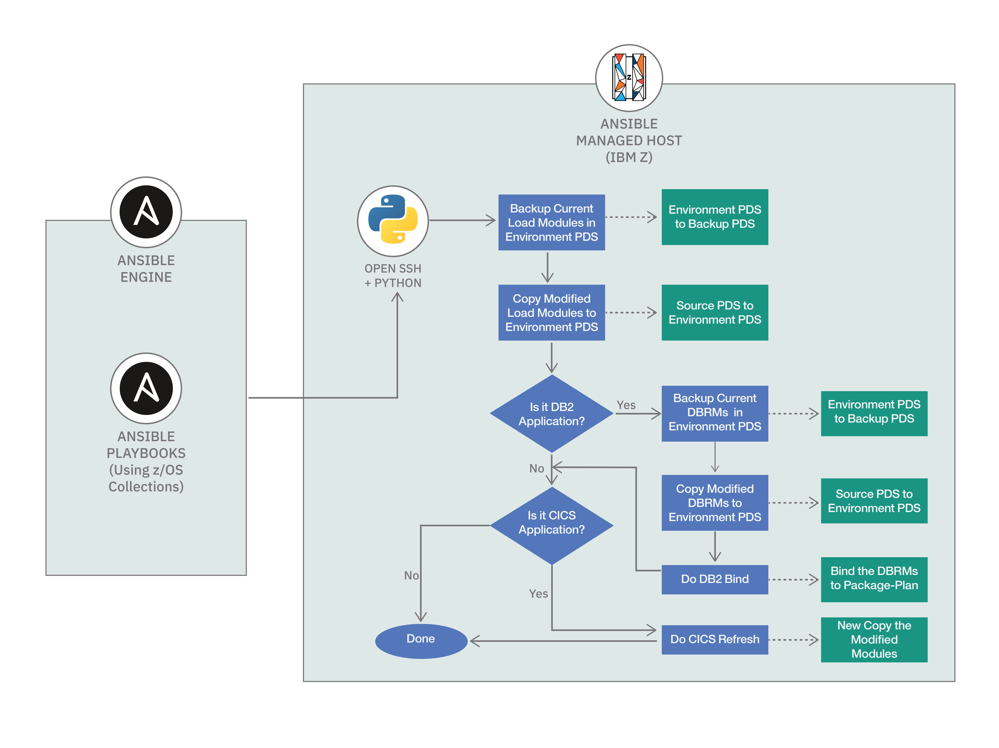
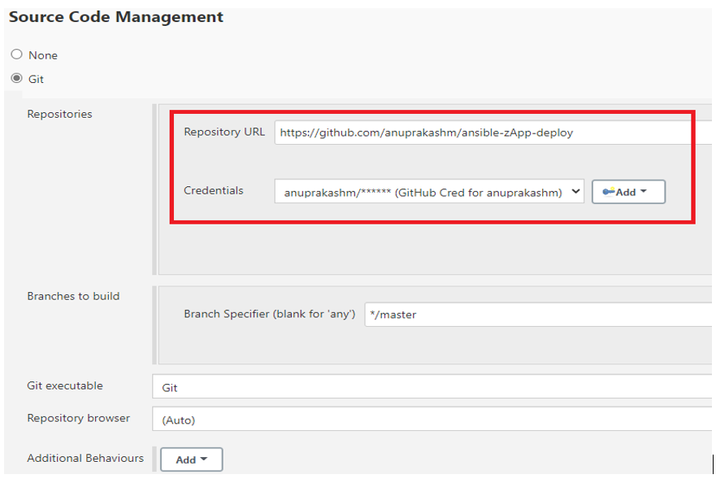
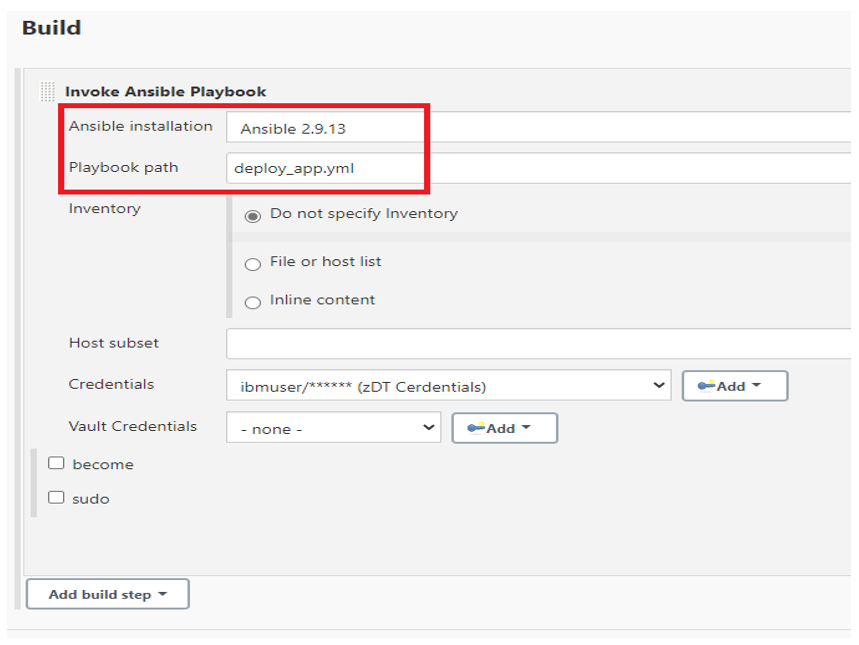

# Simplify mainframe application deployments using Ansible

## Summary

Ansible is a simple yet powerful automation tool, which makes it a very popular open-source automation tool. Using Ansible on z/OS, you can extend all the capabilities of Ansible to z/OS platform including platform agnostic integrated DevOps.

This code pattern shows you how to use Ansible on z/OS to complete common actions needed to do a simple deploy of a sample CICS-COBOL application. 

## Description

IBM Z, is the home to mission critical applications as it offers unparalleled quality of services including security, availably, reliability and scalability. DevOps technologies can be used with IBM Z including Continuous Integration (CI), Continuous Deployment (CD) and automated testing.  Like any platform, you can integrate enterprise tools like Git, Jenkins, SonarQube, Artifactory to create a DevOps pipeline for applications which run on z/OS.

Open source based Ansible automation is one of the tools in the DevOps toolchain that can simplify a variety of things including application deployments, middleware provisioning, orchestration and much more. All these can be accomplished using Ansible playbooks, a simple and easy to read script, written in YAML, which can be version controlled.  Ansible employs an agentless architecture, typically consisting of a x86 Linux based control node with a number of managed nodes that span a variety of platforms like Linux/Unix/Windows (LUW) and IBM Z. Ansible runs playbooks on the control node to automate and bring managed nodes to a desired state. With the introduction of [Red Hat® Certified Ansible Content for IBM Z](https://www.ibm.com/support/z-content-solutions/ansible/), you can accelerate your adoption of Ansible for IBM Z to bring in additional efficiencies in your mainframe DevOps pipelines.

For ease of discussion, consider a simple CICS-COBOL-DB2 application. Typical steps to deploy such a mainframe application include: 

- Backup load modules and DBRMs for rollback actions as needed
- Copy updated load modules to application library in CICS DFHRPL DD concatenation  
- Bind updated DB2 DBRMs/Packages to DB2 plan
- Do CICS refresh (New Copy) to pick up updated load modules  
- In the event of failure, rollback to old load modules and DBRMs

We will perform these actions on z/OS using Ansible below.

## Flow



## Prerequisites

- [Ansible](https://www.ansible.com/) 2.9 or later
- [z/OS Core Collection for Ansible](https://galaxy.ansible.com/ibm/ibm_zos_core)
- [z/OS CICS Collection for Ansible](https://galaxy.ansible.com/ibm/ibm_zos_cics)
- [IBM Open Edition Python, z/OS OpenSSH, and IBM Z Open Automation Utilities](https://ibm.github.io/z_ansible_collections_doc/ibm_zos_core/docs/source/requirements_managed.html) in managed node (z/OS)
- Any Git based repositories like [GitHub](https://github.com/), [GitLab](https://about.gitlab.com/), [Bitbucket](https://bitbucket.org/) etc.
- [Jenkins](https://www.jenkins.io/doc/book/getting-started/) orchestrator

## Estimated Time

It should take about 3 - 4 hours to complete this tutorial .

## Instructions

1. Define the Ansible environment configuration using [./ansible.cfg](./ansible.cfg) and [./inventory](./inventory).  These files will need to be customized to your environment to define the z/OS managed node and to provide the Python interpreter path in z/OS Unux Systems Services (USS). Required  environment variables are defined in a variable file name [./group_vars/all.yml](./group_vars/all.yml).

2. Define the variables that can be used in the deployment playbook in a variable file named [./group_vars/deploy_vars.yml](./group_vars/deploy_vars.yml). This is for the  ease of maintaining the playbook. Following is an excerpt of the deployment variables file:
```YAML
# Is the application Batch, DB2, CICS or both.  Set true or false as per your application.
cics: true
db2: true

# Load modules - Source, Target and backup PDS and modified modules
load_src: #<Load Module source PDS>
load_tgt: #<Load Module target PDS>
load_bkp: #<Load Module backup PDS>
load_mems: #<List of modified Load modules to deploy, Ex:['LOAD01','LOAD02','LOAD03']>

# DBRMs -  Source, Target and backup PDS and modified DBRMs
dbrm_src: #<DBRM source PDS>
dbrm_tgt: #<DBRM target PDS>
dbrm_bkp: #<DBRM backup PDS>
dbrms: #<List of modifies DBRMs to BIND, Ex: ['DBRM01','DBRM02','DBRM03']>

# DB2 parameters if DB2 is set to true
db2_subsys: #<DB2 Subsystem name>
db2_package: #<DB2 Package name>
db2_plan: #<DB2 Plan name>

# CICS programs if CICS is set to true
cics_pgms: #<List of modified CICS programs to deploy, Ex:['LOAD01','LOAD02','LOAD03']>
```

3. Create an Ansible playbook named [./deploy_app.yml](./deploy_app.yml) to deploy the application. The variables ```db2``` and ```cics``` defined in [./group_vars/deploy_vars.yml](./group_vars/deploy_vars.yml) can help in deciding whether a DB2 bind or CICS refresh or both DB2 bind and CICS refresh are required to complete application deployment. This helps to use the same playbook with multiple application sub-types like CICS-COBOL, COBOL-DB2 or just COBOL. Following is an excerpt of the deployment playbook:
```YAML
- name: Deploy Z Application
  hosts: all

  gather_facts: no

  collections:
    - ibm.ibm_zos_core
    - ibm.ibm_zos_cics
  
  vars_files: "./group_vars/deploy_vars.yml"

  environment: "{{ environment_vars }}"  
  
  tasks:  
    - name: Backup Load modules in target PDS
      include_tasks: "./tasks/bkp_load.yml"

    - name: Copy Load modules to target PDS
      include_tasks: "./tasks/copy_load.yml"

    - name: Backup DBRMs in target PDS
      include_tasks: "./tasks/bkp_dbrm.yml"
      when: (db2 == true)

    - name: Copy DBRMs to target PDS
      include_tasks: "./tasks/copy_dbrm.yml"    
      when: (db2 == true)

    - name: Bind DBRMs to DB2 Plan
      include_tasks: "./tasks/db2_bind.yml"    
      when: (db2 == true)

    - name: CICS Refresh
      include_tasks: "./tasks/cics_refresh.yml"    
      when: (cics == true)    
```

4.	One way to back up and copy the load modules and DBRM's from source libraries to backup libraries and target libraries is using the IEBCOPY utility. Use the Ansible template module and Jinja2 templating to dynamically generate the JCL required to back up or copy your load modules.  An example of the Jinja2 template is located at [./files/LOADBKUP.j2](./files/LOADBKUP.j2) for JCL to backup load module. All the variables inside double curly braces ```{{}}``` in the Jinja2 template can substitute the values from our variable file [./group_vars/deploy_vars.yml](./group_vars/deploy_vars.yml). The substitution is performed by the Ansible template module during the playbook execution. The ```for``` loop in the ```SYSIN``` can replicate the ```select``` statement for each of the load members to be backed up during the execution. Following is an excerpt of the Jinja2 template for backing up load modules:
```JCL
//COPYLOAD EXEC PGM=IEBCOPY,REGION=4M          
//*MAIN SYSTEM=JLOCAL,LINES=99                 
//SYSPRINT DD SYSOUT=*                         
//SYSUT1 DD DSN={{ load_tgt }},     
//       DISP=SHR                              
//SYSUT2 DD DSN={{ load_bkp }},      
//       DISP=SHR                              
//SYSUT3   DD UNIT=VIO,SPACE=(CYL,(10))        
//SYSUT4   DD UNIT=VIO,SPACE=(CYL,(10))        
//SYSIN    DD *                                
  COPYMOD INDD=SYSUT1,OUTDD=SYSUT2,MAXBLK=32760

  SELECT M=(({{ load_mem }},,R))    
                   
/* 
```

5. Create a task to back up load modules named  [./tasks/bkp_load.yml](./tasks/bkp_load.yml). This task can dynamically generate JCL to back up load modules in z/OS using the Jinja2 template with the Ansible template module and then subsequently execute the generated JCL. Following is an excerpt of the load modules backup task.
```YAML
- name: Job template render for LOAD module backup
  template:
    src: './files/LOADBKUP.j2'
    dest: '/tmp/LOADBKUP.bin'
  register: result

- name: LOAD module backup - Template Response
  debug:
    msg: "{{ result }}"
       
- name: Convert LOAD backup JCL encoding from ISO8859-1 to IBM-1047
  zos_encode:
    src: '/tmp/LOADBKUP.bin'
    dest: '/tmp/LOADBKUP.jcl'
    to_encoding: IBM-1047
    from_encoding: ISO8859-1
  register: result

- name: LOAD backup JCL Encoding conversion response
  debug:
    msg: "{{ result }}"   

- name: Submit the job from USS
  zos_job_submit:
    src: '/tmp/LOADBKUP.jcl'
    location: USS
    wait: true
  register: result

- name: Job Response
  debug:
    msg: "{{ result.jobs[0].ret_code }}"
```

6. Create JCL templates and tasks to copy the load modules to target libraries named [./tasks/copy_load.yml](./tasks/copy_load.yml), backing up DBRM's named [./tasks/bkp_dbrm.yml](./tasks/bkp_dbrm.yml), and copying DBRM's to target libraries – [./tasks/copy_dbrm.yml](./tasks/copy_dbrm.yml).  These tasks are very similar to step 4 and step 5.

7. Use the Ansible template module and Jinja2 templating to generate DB2 bind JCL. Our Jinja2 template is named [./files/DB2BIND.j2](./files/DB2BIND.j2) for Db2 bind JCL. All variables inside double curly braces ```{{}}``` in Jinja2 template can substitute with the values from the variable file [./group_vars/deploy_vars.yml](./group_vars/deploy_vars.yml) during execution. This substitution is done by the Ansible template module. The ```for``` loop in the ```SYSIN``` can replicate the ```BIND PACKAGE``` statement for the required DBRMs. Following is an excerpt of Jinja2 template for DB2 bind JCL:
```JCL
//BIND    EXEC PGM=IKJEFT01,DYNAMNBR=20
//STEPLIB  DD  DSN=DSNC10.SDSNLOAD,DISP=SHR
//DBRMLIB  DD  DSN={{ dbrm_tgt }},DISP=SHR
//SYSPRINT DD  SYSOUT=*
//SYSTSPRT DD  SYSOUT=*
//SYSUDUMP DD  SYSOUT=*
//SYSIN  DD *
/*
//SYSTSIN DD *
DSN SYSTEM(DBCG)

BIND PACKAGE ({{ db2_package }})                          -
     ISO(CS)                                              -
     CURRENTDATA(NO)                                      -
     MEMBER({{ dbrm }})                                   -
     DEGREE(1)                                            -
     DYNAMICRULES(BIND)                                   -
     ACTION (REPLACE)                                     -
     EXPLAIN(NO)                                          -
     OWNER(ADCDMST)                                       -
     QUALIFIER(GENAPP1)                                   -
     ENABLE(BATCH,CICS)                                   -
     REL(DEALLOCATE)                                      -
     VALIDATE(BIND)


BIND PLAN (GENAONE)                                       -
     PKLIST(NULLID.*, *.{{ db2_package }}.*)              -
     CURRENTDATA(NO)                                      -
     ISO(CS)                                              -
     ACTION (REP)                                         -
     OWNER(ADCDMST)                                       -
     QUALIFIER(GENAPP1)                                   -
     REL(DEALLOCATE)                                      -
     ACQUIRE(USE)                                         -
     RETAIN                                               -
     NOREOPT(VARS)                                        -
     VALIDATE(BIND)

RUN PROGRAM(DSNTIAD) PLAN({{ db2_plan }}) -
    LIB('DSNC10.{{ db2_subsys }}.RUNLIB.LOAD')
END
/*
```

8. Create an Ansible task named [./tasks/db2_bind.yml](./tasks/db2_bind.yml) to generate Db2 BIND JCL, copy the JCL to a z/OS USS path, and execute using the Ansible playbook. This is very similar to what is mentioned in Step 5 for load modules backup.

9. Do the CICS refresh (new copy) from an Ansible playbook by executing ```CEMT``` transaction in the target CICS region. 

   * **Option 1** \
     To achieve this using Ansible, use the ```zos_operator``` module to issue ```CEMT``` as a console command in the playbook task.  See [./tasks/cics_refresh.yml](./tasks/cics_refresh.yml). The variable ```cics_pgms``` can resolve from the variables file located at [./group_vars/deploy_vars.yml](./group_vars/deploy_vars.yml). Do the CICS new copy for all the programs listed in ```cics_pgms```. Following is an excerpt of the CICS refresh task.
     ```YAML
     - name: New Copy CICS Program
       zos_operator:
         cmd: 'F CICSTS55,CEMT S PROG({{ item }}) NEW'
       loop: "{{ cics_pgms }}"
       register: result

     - name: Response for New Copy
       debug:
         msg: "{{ result }}"
     ```

   * **Option 2** \
     If CICS management client interface (CMCI) setup in the environment ```ibm_zos_cics``` module can be used to do the CICS New Copy of the programs instead of ```zos_operator``` module. See [./tasks/cics_refresh.yml](./tasks/cics_refresh.yml), comment the code below ```Option 1: New Copy CICS programs using MVS operator command``` and uncomment the code below ```Option 2: New Copy CICS programs using z/OS CICS collection```. The variables ```context```, ```scope```, ```cmci_host```, ```cmci_port``` and ```scheme``` should be set in [./group_vars/all.yml](./group_vars/all.yml) based on your CMCI setup. The variable ```cics_pgms``` can resolve from the variables file located at [./group_vars/deploy_vars.yml](./group_vars/deploy_vars.yml). Do the CICS new copy for all the programs listed in ```cics_pgms```. Following is an excerpt of the CICS refresh task using ```ibm_zos_cics```.
     ```YAML
     - name: New Copy CICS Program
       delegate_to: localhost
       cmci_action:
         context: '{{ context }}'
         scope: '{{ scope }}'
         cmci_host: '{{ cmci_host }}'
         cmci_port: '{{ cmci_port | int }}'
         scheme: '{{ scheme }}'
         action_name: NEWCOPY
         type: CICSProgram
         resources:
           filter:
             program: '{{ item }}'
       loop: "{{ cics_pgms }}"
       register: result

     - name: Response for New Copy
       debug:
         msg: "{{ result }}"
     ```

10. Perform rollback to reverse the changes in target libraries if required. Create an Ansible task - [./rollback_app.yml](./rollback_app.yml) to copy back the previous version of the load modules and DBRMs from the backup libraries to the target environment libraries. Bind the DBRM's to the Db2 plan and do CICS refresh (new copy) to the CICS load modules based on the parameters ```db2``` and ```cics``` defined in variables file - “[./group_vars/deploy_vars.yml](./group_vars/deploy_vars.yml)”. 

### DevOps integration: Versioning and integrating Ansible playbooks in CI-CD pipeline

When we think of version controlling and integrating Ansible playbooks in a DevOps pipeline we need an SCM and a CI-CD pipeline orchestrator tool. Git based repositories like Github, Gitlab, and Bitbucket are some of the most widely used version control tools. Jenkins is one of the most popular CI-CD pipeline orchestrators. We can see these tools in most businesses that adopted DevOps.  Now, we can go through various steps to integrate Ansible playbooks into the CI-CD pipeline.

This code pattern uses GitHub as its SCM to version control Ansible playbooks, as it is a popular SCM that can easily integrate with the Jenkins orchestrator and work seamlessly with IBM z/OS. However, you can use any SCM that can integrate with your existing CI-CD pipeline orchestrator and Ansible.

Do the following configurations in Jenkins to integrate with Ansible:

1. Define the Ansible installation path in Jenkins from Manage Jenkins ➡ Global Tool Configuration ➡ Ansible ➡ Ansible installations ➡ Add Ansible and provide name and path to the Ansible executables.


2. Install the Ansible z/OS Core and z/OS CICS collections under Jenkins user by creating a Jenkins job and by executing the installation command from ```Execute shell``` drop down option under ```Add build step``` as shown in the below figure. Multiple shell commands can be executed as needed.  This is a one-time activity.


3. Create a Jenkins job and add Git as source code management and provide the URL of the GitHub repository containing Ansible playbooks. This is to pull our Ansible playbook repository from GitHub.



4. Add a build step to “invoke Ansible playbook”. Choose the Ansible installation path given in the Global Tool configuration. Provide the playbook path in Jenkins workspace. Provide all other parameters needed under this build step.



5. Execute the playbook from Jenkins by running the Jenkins job defined. This Jenkins job can be triggered in many ways like webhook triggers, calling the Jenkins REST API for job build, using scheduler, manual trigger, etc. If the Ansible engine is installed on a different server other than Jenkins, then submit the Jenkins job to the Jenkins agent running in the Ansible engine server node.

For the complete sample playbooks, tasks, templates and files discussed above, please visit the GitHub repo - [Ansible-IBM-Z-App-Deploy](https://github.com/anuprakashm/Mainframe-Applications-deployments-using-Ansible/)

## Related Links

- Read more on Ansible here - [Ansible Documentation](https://docs.ansible.com/).
- Read on Ansible collections for z/OS here - [Ansible Galaxy](https://galaxy.ansible.com/search?deprecated=false&keywords=zos&order_by=-relevance&page=1).

## Next Steps

- Automated generation of [./group_vars/deploy_vars.yml](./group_vars/deploy_vars.yml) from the build process to deploy only the modified components
- Implement a full tracking mechanism for all deployments to understand what is deployed into which environments. 
- Streamline the The backup process. It must be named and tracked and stored to allow for rollback at any time in the future. Backup process can be implemented by integrating with SCMs or Binary repositories used.
- Streamline the Rollback process by integrating with SCMs or Binary repositories used.
- The tasks mentioned in here can be achieved in multiple ways using Ansible.  Explore more on Ansible.
- Watch out this space for new Ansible collections for z/OS - [Ansible Galaxy](https://galaxy.ansible.com/search?deprecated=false&keywords=zos&order_by=-relevance&page=1). 

## License

This code pattern is licensed under the Apache License, Version 2. Separate third-party code objects invoked within this code pattern are licensed by their respective providers pursuant to their own separate licenses. Contributions are subject to the [Developer Certificate of Origin, Version 1.1](https://developercertificate.org/) and the [Apache License, Version 2](https://www.apache.org/licenses/LICENSE-2.0.txt).

[Apache License FAQ](https://www.apache.org/foundation/license-faq.html#WhatDoesItMEAN)